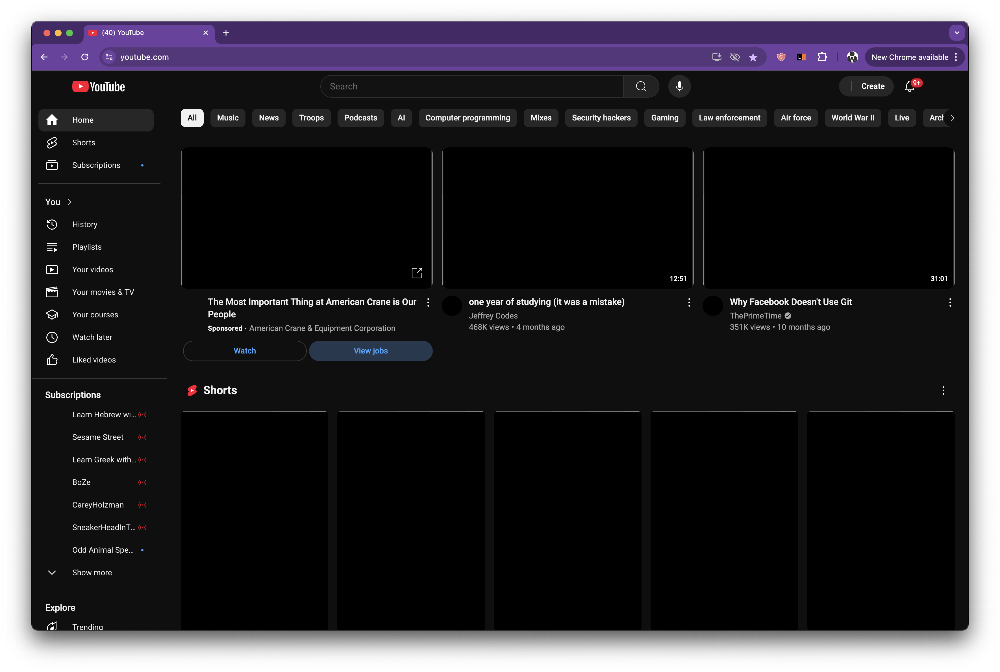

  

<h1 align="center">DarkScroll</h1>

  A minimalist Chrome extension that removes YouTube thumbnails to help you scroll less and focus more.

  
  
  

---

## Overview

**DarkScroll** is a lightweight, open-source Chrome extension designed to reduce time spent on YouTube by eliminating flashy thumbnails and clickbait.

We've all been trapped in the YouTube vortex — one thumbnail leads to another, and suddenly an hour's gone. DarkScroll breaks that cycle by replacing all video thumbnails with a plain black square.

Here’s what YouTube looks like with **DarkScroll** running — distraction-free and clean:

  

---

## Features

- Instantly hides all YouTube thumbnails
- Reduces visual temptation and decision fatigue
- Helps stop the autoplay-scroll-click loop
- Runs only on YouTube, no tracking or background activity
- 100% open source and customizable

---

##  Available On

You can install **DarkScroll** from the official  
**[Chrome Web Store →](https://chrome.google.com/webstore/detail/your-extension-id)**

---

## Installation (Manual)

1. Clone this repo:  
   git clone https://github.com/EmGeeDoubleU/DarkScroll.git

2. Navigate to the folder:  
   cd DarkScroll

3. Open Chrome and go to:  
   chrome://extensions/

4. Enable "Developer mode" in the top-right corner

5. Click "Load unpacked"

6. Select the DarkScroll folder you just cloned

7. Visit YouTube — thumbnails should now appear as solid black squares

---

##  How to Contribute

We welcome contributions from the community! Here's how you can help:

1. Check out the [issues](https://github.com/EmGeeDoubleU/DarkScroll/issues) tab for ideas  
2. Fork this repo and create a new branch  
3. Make your changes  
4. Submit a pull request — all contributions are reviewed before merging

Please read our [Contributing Guidelines](CONTRIBUTING.md) and [Code of Conduct](CODE_OF_CONDUCT.md) before getting started.
---

## Maintainer

**Michael Warshowsky**  
[GitHub @EmGeeDoubleU](https://github.com/EmGeeDoubleU)
